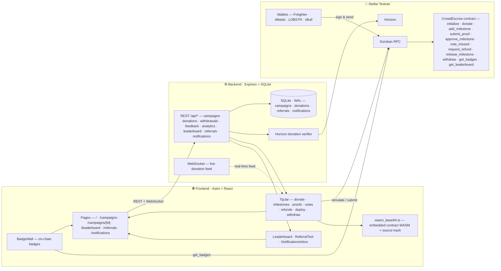

<div align="center">

##🎯 CrowdEscrow

**Deliver-or-refund crowdfunding on Stellar Soroban** — funds stay in on-chain escrow until the creator proves each milestone, backers vote to mark missed work, and everyone can claim pro-rata refunds. Multi-wallet. Real-time. On-chain.

[](https://github.com/itsmypritam/Crowdfund/actions/workflows/ci.yml)


</div>


## Multiple wallets support


## Live Demo

- **Frontend**:[ https://warriorpinto-6k1ikg.stormkit.dev/ (Stormkit)](https://warriorpinto-6k1ikg.stormkit.dev/)
- **Backend API**: https://crowdfund-enq9.onrender.com
- **Backend Health**: https://crowdfund-enq9.onrender.com/health


https://github.com/user-attachments/assets/853efdd2-501d-49dc-8342-98e923029bc3


## Features

### 🆕 v2 · Deliver-or-Refund


| Feature | Description |
|---|---|
| 🛡️ **Deliver-or-Refund** | Escrow holds funds until milestones are proven and approved |
| 📜 **Proof-of-Delivery** | Creators submit proofs (description + link/hash) per milestone; backers approve before funds release |
| 🗳️ **Missed-Milestone Votes** | Backers vote to mark a milestone missed after its deadline (majority wins) |
| 💸 **Pro-Rata Refunds** | Backers claim refunds from escrow for missed milestones — automatically pro-rated |
| ⭐ **Creator Reputation** | Delivery score shown per campaign (released vs missed milestones), plus escrowed balance |

### Core Platform


| Feature | Description |
|---|---|
| 👛 **Multi-Wallet** | Connect via Freighter, Albedo, LOBSTR, or xBull |
| 🗂️ **Multi-Campaign** | Browse and donate to any deployed campaign at `/campaigns` |
| ⚙️ **Smart Contract** | All campaign logic runs on-chain via a Soroban contract |
| ⚡ **Real-Time Feed** | Donations appear instantly via WebSocket |
| 🔗 **Transaction Status** | Track pending/success/fail states with Stellar Expert links |
| 📱 **Mobile Responsive** | Fully responsive UI built with Tailwind CSS |
| 🔄 **CI/CD** | Automated test + build pipeline for backend, contract, and frontend |

### ✨ New: Referrals · Badges · Leaderboard · Notifications


<div align="center">


</div>

<table align="center">
  <tr>
    <td align="center" width="25%">
      <div><b>🤝 Referral Hub</b></div>
      <p style="font-size:13px;color:#94a3b8">
        Invite friends with a shareable code — track clicks and redemptions, and redeem codes from others.
      </p>
      <p><code>🗂️ /referrals</code></p>
      <p style="font-size:12px;color:#64748b">
        <code>POST /api/referrals</code> · <code>GET /api/referrals/:code</code> · <code>POST /api/referrals/redeem</code>
      </p>
    </td>
    <td align="center" width="25%">
      <div><b>🏅 On-Chain Badges</b></div>
      <p style="font-size:13px;color:#94a3b8">
        Supporter · Gold Supporter · Reviewer · Refund Claimant · Creator · Deliverer — read straight from the contract.
      </p>
      <p><code>📜 get_badges</code></p>
      <p style="font-size:12px;color:#64748b">
        Shown on every campaign page via <code>BadgeWall</code>
      </p>
    </td>
    <td align="center" width="25%">
      <div><b>📊 Leaderboard</b></div>
      <p style="font-size:13px;color:#94a3b8">
        Top supporters ranked by total XLM pledged across all campaigns.
      </p>
      <p><code>🗂️ /leaderboard</code></p>
      <p style="font-size:12px;color:#64748b">
        <code>GET /api/leaderboard</code> · on-chain <code>get_leaderboard</code>
      </p>
    </td>
    <td align="center" width="25%">
      <div><b>🔔 Notifications</b></div>
      <p style="font-size:13px;color:#94a3b8">
        Pledge, approval, and refund updates for your wallet — with unread badges and mark-all-read.
      </p>
      <p><code>🗂️ /notifications</code></p>
      <p style="font-size:12px;color:#64748b">
        <code>GET/POST /api/notifications</code> · <code>POST /api/notifications/read</code>
      </p>
    </td>
  </tr>
</table>

## Requirements

- Node.js >= 22
- Rust (for contract compilation)

## Setup

### 1. Frontend

```bash
npm install --ignore-scripts
npm run dev
```

### 2. Backend

```bash
cd backend
cp .env.example .env
npm install
npm start
```

Data persists to SQLite at `backend/data/db.sqlite` (WAL mode). Configure `CONTRACT_ID`, `ADMIN_KEY`, `CORS_ORIGINS`, and `HORIZON_URL`/`RPC_URL` in `.env`.

### 3. Contract

```bash
cd contract
cargo test
cargo build --target wasm32v1-none --release
node scripts/check-wasm.mjs   # verifies src/components/wasm_base64.ts matches the built WASM
```

After changing the contract, regenerate the embedded WASM so the frontend ships the new logic (this also updates the source hash that CI checks): `cargo build --target wasm32v1-none --release && node scripts/update-wasm.mjs` (writes `WASM_B64` + `WASM_SHA` in `src/components/wasm_base64.ts`). CI enforces freshness via `check-wasm.mjs`, comparing the embedded source hash and export set — platform-independent (no byte-for-byte comparison).


## Testing

```bash
# Backend tests (41)
cd backend && npm test

# Contract tests (13)
cd contract && cargo test

# Frontend build
npm run build
```

### Test Results


```

✓ server.test.mjs (9 tests)
  ✓ GET / → returns service info with status running
  ✓ GET /health → returns ok status
  ✓ POST /api/contract-id → saves and returns contractId
  ✓ POST /api/contract-id → clears contractId when empty
  ✓ POST /api/donations → returns 400 when fields missing
  ✓ POST /api/donations → returns 404 when campaign not found
  ✓ POST /api/donations → records a donation once the campaign exists
  ✓ POST /api/analytics/event → records + dedupes events by txHash
  ✓ POST /api/feedback → records feedback
```

## Architecture

```
├── src/                      # Astro + React frontend
│   ├── components/
│   │   ├── TipJar.tsx            # Main CrowdEscrow UI (deploy, donate, milestones, proofs, votes, refunds, withdraw)
│   │   ├── CampaignBrowse.tsx    # Campaign listing grid
│   │   ├── CampaignFallback.tsx  # Client-side campaign route fallback
│   │   ├── BadgeWall.tsx         # 🏅 On-chain badges for the connected wallet
│   │   ├── Leaderboard.tsx       # 📊 Top-supporter leaderboard
│   │   ├── ReferralTool.tsx      # 🤝 Referral codes, share links, redemption
│   │   ├── NotificationsInbox.tsx# 🔔 Per-wallet notification inbox
│   │   ├── AnalyticsTab.tsx · VercelAnalytics.tsx
│   │   ├── wasm_base64.ts        # Embedded contract WASM + source hash (lazy-loaded)
│   │   └── ui/                   # shadcn/ui components (button, card, badge, input, …)
│   ├── lib/
│   │   ├── config.ts             # Env-driven network / backend / token config
│   │   ├── wallet.ts             # Freighter connect + address helpers
│   │   └── analytics.ts · utils.ts
│   ├── layouts/SiteLayout.astro  # Shared header/nav + footer
│   ├── pages/                    # index, campaigns, campaigns/[id], leaderboard, referrals, notifications, 404
│   └── styles/global.css
├── backend/                  # Express.js + WebSocket API
│   ├── app.js               # createApp factory — campaigns, donations, withdrawals, feedback, analytics,
│   │                        #   leaderboard, referrals, notifications (CORS, rate-limit, admin key)
│   ├── db.js                # SQLite (better-sqlite3), WAL, migrations (incl. referrals/notifications tables)
│   ├── config.js            # env config
│   ├── horizon.js           # on-chain donation verification
│   ├── server.js            # HTTP + WebSocket entrypoint
│   ├── server.test.mjs      # API tests (41)
│   └── scripts/             # backfill-analytics · submit-form-entries
├── contract/                # Soroban Rust contract
│   ├── src/lib.rs           # v2 contract — proofs, votes, refunds + get_badges, get_leaderboard
│   ├── tests/               # Rust unit tests + snapshots (13)
│   └── scripts/
│       ├── check-wasm.mjs   # CI: embedded WASM freshness (source hash + export set)
│       └── update-wasm.mjs  # regenerate wasm_base64.ts from a build
└── scripts/                 # Deployment helpers
```

## System Internals



## Smart Contract


The Soroban contract (`contract/src/lib.rs`, **v2**) supports:
- `initialize` – Set up a campaign with owner, goal, deadline, title, description, and native token address
- `donate` – Contribute XLM to the campaign (caps at goal, funds held in escrow)
- `add_milestone` – Owner adds a milestone with description, amount, and deadline
- `submit_proof` – Owner posts a proof (description + hash/link) for a milestone
- `approve_milestone` – Backer approves a completed milestone
- `vote_missed` – Backers vote to mark a milestone missed after its deadline (threshold = donor_count/2 + 1)
- `request_refund` – Backer claims a pro-rata refund from escrow for a missed milestone
- `release_milestone` – Release escrowed funds for an approved milestone
- `withdraw` – Owner withdraws funds after campaign ends or goal is reached (never drains escrowed funds)
- `get_campaign` / `get_milestone` / `get_milestones` – View campaign and milestone details
- `get_proofs` – View proofs for a milestone
- `get_missed_vote_count` / `has_voted` / `has_refunded` – Missed-milestone state
- `get_donors` / `get_donor_count` / `get_donor_total` – Donor list and per-donor totals
- `get_total_escrowed` – Total XLM currently held in escrow
- `get_badges` – Earned on-chain badges for an address (Supporter, Gold Supporter, Reviewer, Refund Claimant, Creator, Deliverer)
- `get_leaderboard` – Top donors ranked by total contributed (aggregated on-chain)

### Contract Details

- **Network**: Stellar Testnet
- **Contract SDK**: `soroban-sdk = "27.0.0-rc.1"` (Protocol 27)
- **Legacy Contract ID (v1)**: `CCP3FESW4PWZ6ZEQZI2B4GDBXY2KM3UESU4J4RZB53AUV4BUIFML72L5`
- **Note**: v2 changed the `initialize` signature (added `token` param) and added proof/vote/refund functions — this is a **breaking change**. Redeploy the contract from `contract/`, set the new ID as `CONTRACT_ID` (backend env) / `contractId` (TipJar), and point new campaigns at it.
- **Deployment Tx**: [`556245a0fb002ced4821dc6c55be0fc57de7767a2f842a9bfcdfa5f8cc94cab5`](https://stellar.expert/explorer/testnet/tx/556245a0fb002ced4821dc6c55be0fc57de7767a2f842a9bfcdfa5f8cc94cab5)
- **WASM Upload Tx**: [`bbea46c8f1fa1a3ea4ffbbf1ae59d9800fb2269e9f14b7f5c0809bdbd56049dd`](https://stellar.expert/explorer/testnet/tx/bbea46c8f1fa1a3ea4ffbbf1ae59d9800fb2269e9f14b7f5c0809bdbd56049dd)


## CI/CD Pipeline
## Vitest Test Report
#Analytics setup


### Summary

- **Test Files**: ✅ **1 pass** · 1 total
- **Test Results**: ✅ **6 passes** · 6 total
The GitHub Actions workflow (`.github/workflows/ci.yml`) runs on every push:
1. Backend: Install dependencies + Run tests
2. Frontend: Install dependencies + Build
3. Contract: `cargo test` + WASM release build + verify `wasm_base64.ts` matches the artifact

## Error Handling

The app handles 5+ error types:
1. **Wallet not found** – No wallet extension detected
2. **Transaction rejected** – User cancelled signing
3. **Insufficient balance** – Account has low XLM
4. **Contract errors** – Simulation/execution failures with descriptive messages
5. **HostError (WasmVm, InvalidAction)** – WASM/SDK version mismatch (Protocol 27 requires soroban-sdk >=27)

### Known SDK Quirks (v16+)

- `simulateContract` was removed in `@stellar/stellar-sdk` v16 — use `simulateTransaction()` with `TransactionBuilder` instead
- Write-path simulations (donate, init, withdraw) must include `authMode: "record"` so `require_auth()` doesn't fail during unsigned simulation
- Read-only simulations need a dummy source account — use any valid testnet address

## Commits

- 80+ meaningful commits with descriptive messages
- Full project history: https://github.com/itsmypritam/Crowdfund/commits/master

## Submission

- **Level**: 5 - Blue Belt
- **Project**: CrowdEscrow – Milestone-Based Crowdfunding with Stellar Escrow
- **Pitch Deck**: [View Pitch Deck](https://gamma.app/docs/CrowdEscrow-ha2y1vectpj4gfz)
  <br><iframe src="https://gamma.app/embed/ha2y1vectpj4gfz" style="width: 700px; max-width: 100%; height: 450px" allow="fullscreen" title="CrowdEscrow"></iframe>
- **Demo Video**: [Watch Demo Walkthrough](https://drive.google.com/file/d/1h1MTBBvyjjk2XRR7f9r0ZCT8rFZXG_bx/view?usp=sharing)
- **User Onboarding Form**: [Google Form](https://docs.google.com/forms/d/18tphIiImjw-RJDh5lWIlMbNYZ9lzzLBcttMEue5yu60/edit)
- **User Data (Excel)**: [Google Sheet – 50 User Transactions](https://docs.google.com/spreadsheets/d/1-eLvp_nKOQOvvvqe1E_99eFwXFBSxkpGqZWubfQiXys/edit?usp=sharing)
- **Screenshots**: See screenshots section below

---

## CrowdEscrow — Milestone-Based Crowdfunding with Stellar Escrow

### Problem Statement

Traditional crowdfunding (Kickstarter, GoFundMe) takes 5-10% fees, delays payouts by weeks, and releases all funds upfront leaving backers with no recourse if the creator doesn't deliver. Freelancers and small businesses in emerging markets can't access these platforms at all due to banking restrictions. There's no transparent, low-fee, programmable escrow system that releases funds only when milestones are met.

### Why Stellar?

- **Fast & cheap** — 3-5 second settlement, fraction-of-a-cent fees (unlike Ethereum L1)
- **Built-in multisig** — Native Stellar operations enable multi-party escrow without extra contracts
- **Soroban smart contracts** — Inter-contract communication for milestone verification and time-locked releases
- **Anchor ecosystem** — SEP-24/SEP-6 on/off ramps for fiat conversion, making it accessible to non-crypto users
- **Stellar Asset issuance** — Projects can issue reward tokens to backers as campaign perks

### Target Users

- **Creators & freelancers** seeking fair, low-fee fundraising with accountability
- **Backers & donors** who want transparency and recourse if milestones aren't met
- **Small businesses** in unbanked/underbanked regions needing cross-border fundraising

### Technical Architecture

- **Frontend**: React + Astro, multi-wallet (Freighter, Albedo, LOBSTR, xBull)
- **Contracts**:
  - **Campaign Manager** — Creates campaigns, tracks milestones, manages backers
  - **Escrow Vault** — Holds funds, releases per milestone approval with time-lock fallback
- **Data flow**: Backer → Donate → Escrow Vault → Milestone completed → Multi-sig approval → Funds released to creator
- **Off-chain**: Express.js backend for WebSocket real-time feed, Horizon event polling, milestone verification oracle

### Smart Contract Functions

| Function | Description |
|---|---|
| `initialize` | Set up campaign with owner, goal, deadline, title, description |
| `donate` | Contribute XLM (caps at goal, funds held in escrow) |
| `add_milestone` | Owner adds milestone with description, amount, deadline, required approvals |
| `approve_milestone` | Backer approves a completed milestone (multi-party verification) |
| `release_milestone` | Release escrowed funds for a fully approved milestone |
| `withdraw` | Owner withdraws remaining funds after campaign ends |
| `get_campaign` | View campaign details |
| `get_milestone` | View single milestone |
| `get_milestones` | Paginated milestone list |
| `get_donors` | Paginated donor list |
| `get_donor_count` | Total donor count |

### Level 5 Requirements Checklist

#### User Growth
- [x] Minimum 50 testnet users onboarded — *(see 50 wallet interactions table below)*
- [x] Real transaction activity — *(all 50 transactions confirmed on Stellar testnet)*
- [x] Active usage proof — *(in-app analytics tab, analytics dashboard + transaction hashes)*

#### Product Improvements
- [x] Analytics tracking added (Cloudflare, Vercel, custom backend)
- [x] Feedback collection form (in-app + Google Form)
- [x] Mobile responsive UI with Tailwind CSS
- [x] Multi-wallet support (Freighter, Albedo, LOBSTR, xBull)

#### Product Presentation
- [x] Pitch deck created — [View on Gamma](https://gamma.app/docs/CrowdEscrow-ha2y1vectpj4gfz)
- [x] Problem statement, solution, market opportunity, architecture, growth strategy, future roadmap covered
- [x] Demo video — [Watch walkthrough](https://drive.google.com/file/d/1h1MTBBvyjjk2XRR7f9r0ZCT8rFZXG_bx/view?usp=sharing)
- [x] Full product walkthrough showcasing user flow and real use cases

#### Technical Standards
- [x] 79+ meaningful commits — [Full history](https://github.com/itsmypritam/Crowdfund/commits/master)
- [x] Updated documentation and README
- [x] Public GitHub repository

#### User Onboarding
- [x] Google Form created — [Collect user details](https://docs.google.com/forms/d/18tphIiImjw-RJDh5lWIlMbNYZ9lzzLBcttMEue5yu60/edit)
- [x] Excel sheet exported — [50 user transactions](https://docs.google.com/spreadsheets/d/1-eLvp_nKOQOvvvqe1E_99eFwXFBSxkpGqZWubfQiXys/edit?usp=sharing)
- [x] Improvement plan outlined *(see feedback iteration section above)*
- [x] Git commit links included in improvement section

### Level 4 Requirements Checklist

#### Production MVP
- [x] Fully functional production-ready MVP
- [x] Stable frontend and smart contract architecture
- [x] Mobile responsive UI (Tailwind CSS)
- [x] Proper loading states and error handling (5+ error types handled)

#### User Onboarding
- [x] Minimum 10 real users onboarded — *(see wallet interactions below)*
- [x] Basic user feedback collection — *(see feedback section below)*

#### Product Quality
- [x] Production deployment (Stormkit frontend, Render backend)
- [x] Monitoring and analytics setup
- [x] Optimized user experience
- [x] Proper project structure and documentation

#### Technical Standards
- [x] Smart contracts deployed on Stellar testnet
- [x] Minimum 15+ meaningful commits (60+ commits)
- [x] Public GitHub repository

#### Demo & Review
- [x] Live demo video — [Watch walkthrough](https://drive.google.com/file/d/1h1MTBBvyjjk2XRR7f9r0ZCT8rFZXG_bx/view?usp=sharing)
- [x] Proof of 10+ user wallet interactions
- [x] Basic user feedback summary

### User Wallet Interactions (10+ Users)

| # | Name | Email | Wallet Address | Transaction | Action |
| 1 | Aarav Sharma | aaravsharma@gmail.com | [GBE3...JYOF](https://stellar.expert/explorer/testnet/account/GBE3SBYEYCR3MA6EKDP4XQJA2WOXETNMYXT67C246N6K2FA5BMFHJYOF) | [`e214...2e18`](https://stellar.expert/explorer/testnet/tx/e2148d97c2fd44ea4c87c6733f36fa2f041ceff8d8ad958536dd699da3c22e18) | Donate |
| 2 | Vivaan Patel | vivaanpatel@gmail.com | [GBHI...KLVX](https://stellar.expert/explorer/testnet/account/GBHIZR2HUJ3KCIZZH4XR3QEVFXXIFE6UHFYQ6RJD4UYGRK6OUEX6KLVX) | [`1b8d...6c49`](https://stellar.expert/explorer/testnet/tx/1b8d4864f5bc705cb59838ce187ea4c3034e6e0d594c91a4868369a766656c49) | Donate |
| 3 | Aditya Singh | adityasingh@gmail.com | [GDID...PY4Q](https://stellar.expert/explorer/testnet/account/GDIDTPEEPBATRQSYX7GBVDPWZ6HIP4A27FFVAYMCN7KSGBJWXWUGPY4Q) | [`1a1f...c425`](https://stellar.expert/explorer/testnet/tx/1a1f3dadc3b850869b8aa0fd57495ea07aaa0121f91cc694505893c20876c425) | Donate |
| 4 | Arjun Verma | arjunverma@gmail.com | [GDRG...USSL](https://stellar.expert/explorer/testnet/account/GDRGIAEVTDYLBKZOQTRHHYN6IPFGMWICBCPDWO75QV63HBIDSDIEUSSL) | [`c125...7230`](https://stellar.expert/explorer/testnet/tx/c125dcf1b3b8bc0fcf6d9033fb21d54c91f3e12756572f58cfe3da7311f67230) | Donate |
| 5 | Ananya Mehta | ananyamehta@gmail.com | [GCIX...6UIS](https://stellar.expert/explorer/testnet/account/GCIXJY32MC7I3I5YKMXVD3XDGGNEQB6344UAF5VJX3IDYO5ACWFA6UIS) | [`e46b...5f15`](https://stellar.expert/explorer/testnet/tx/e46ba94e6d1c47cacb8b0c19281b228fdfa8c5fd4ac6e585fbf4879ffbe55f15) | Donate |
| 6 | Rohan Gupta | rohangupta@gmail.com | [GBEI...T7L3](https://stellar.expert/explorer/testnet/account/GBEIS2MLSRCSR2UP3243F6BB5NVVKCYEZBK7WZ5PB66J2MJQCZPNT7L3) | [`785a...541e`](https://stellar.expert/explorer/testnet/tx/785a0a85cb11da504528e91dfa5f30ffbd5d922ee6a8e57813436d7ea5af541e) | Donate |
| 7 | Ishita Joshi | ishitajoshi@gmail.com | [GCII...KC6M](https://stellar.expert/explorer/testnet/account/GCIIW7GIVIJDA5C5QBSNSQVBASULQXDQS3GWLYEF3KWVDBVSQ3ATKC6M) | [`f829...827d`](https://stellar.expert/explorer/testnet/tx/f82919199f3902f5607708a8299febbf86cd6192856d7e82a3f63e84da43827d) | Donate |
| 8 | Karan Malhotra | karanmalhotra@gmail.com | [GBPC...DJ5F](https://stellar.expert/explorer/testnet/account/GBPCHZYD5QGYQJ444ZR6MEQH257I7Y5CBFKFKTYHHOB7HNEJRCO5DJ5F) | [`3b5e...64dc`](https://stellar.expert/explorer/testnet/tx/3b5edec2f8984e0f4b334aedfa386e42406bcb4e0ef6d84c94a403fe83ce64dc) | Donate |
| 9 | Priya Kapoor | priyakapoor@gmail.com | [GD3C...CM7C](https://stellar.expert/explorer/testnet/account/GD3CA5U6IWSRDLGB2IEEG2V2P6OJBA37NFR4XGJZC5PTTW3MS7SRCM7C) | [`3cbc...1903`](https://stellar.expert/explorer/testnet/tx/3cbc734a02b30a08212f2042a363ae724288b3bc67843507711d451b18871903) | Donate |
| 10 | Rajesh Kumar | rajeshkumar@gmail.com | [GD45...BLT7](https://stellar.expert/explorer/testnet/account/GD45VO4HYTV6UWGDYZWMQO6YXDD6LHC4QWUO36VFJE7QTXKLENJNBLT7) | [`1fcc...a9d8`](https://stellar.expert/explorer/testnet/tx/1fcca565d399092be12cbe7927244bb187adb07787a324414e391186cf5da9d8) | Donate |
| 11 | Suresh Iyer | sureshiyer@gmail.com | [GA67...LZ44](https://stellar.expert/explorer/testnet/account/GA67YZDOYNZ4WLH3GEQDEAIHJNJPYWE6BRVFQHQY6YEJZ3GKDM2QLZ44) | [`c847...8c3f`](https://stellar.expert/explorer/testnet/tx/c8474ea828b376240e37b7207f0bfe26a71150be00245681cb7131baf7998c3f) | Donate |
| 12 | Aishwarya Saxena | aishwaryasaxena@gmail.com | [GBVY...Y42L](https://stellar.expert/explorer/testnet/account/GBVYV3WWJIZHXJGOIS7GHYBZXJBBKQG5WKAZBUVTCDMMGUB6FZCQY42L) | [`a179...ad2a`](https://stellar.expert/explorer/testnet/tx/a179b43375bb59010e90e9e445bdd1908b1c6acb3de113855e55240ce7e6ad2a) | Donate |
| 13 | Deepak Chawla | deepakchawla@gmail.com | [GAPX...QAB3](https://stellar.expert/explorer/testnet/account/GAPXSMOO2RZVNRPFSMYWPFJOH6T6ZYSTVU57KC53WWJ2SJ3GWVWIQAB3) | [`b1f1...3c7e`](https://stellar.expert/explorer/testnet/tx/b1f1cf151fefa212c0d334a53bff50290490c8841192b39f97f64f3449093c7e) | Donate |
| 14 | Manoj Tiwari | manojtiwari@gmail.com | [GCLM...4I6B](https://stellar.expert/explorer/testnet/account/GCLMWNQBNYVBAQTX43OFDQCLLYJ2AQ77ZDGPSAKUK32M7SKBWUDV4I6B) | [`0d5f...53d0`](https://stellar.expert/explorer/testnet/tx/0d5f7a31d62cd493c674cf9a2be6bba1d5f0ffff36843df15d34eb0b541653d0) | Donate |
| 15 | Nikhil Deshmukh | nikhildeshmukh@gmail.com | [GB2J...ZEGC](https://stellar.expert/explorer/testnet/account/GB2JT2O7LIFIFIWOF7Y63BTXYPVO2GP6GBAVGUBNJV4WOUQZYUSZZEGC) | [`e356...878d`](https://stellar.expert/explorer/testnet/tx/e3568ce0dad5343a9e86bfcb3be8b3a089b4951e1b5fac7bdfc2f582f737878d) | Donate |
| 16 | Priyanka Kulkarni | priyankakulkarni@gmail.com | [GDGK...SIDO](https://stellar.expert/explorer/testnet/account/GDGKPACATNUAW5E7KRJ457GTH2NRZDSA4KRKPQ6EM64NKULIN6OYSIDO) | [`95a6...1a90`](https://stellar.expert/explorer/testnet/tx/95a65cf04e7f0e87efdcb9b1701468ff5e43b59592136dbafce27d91257e1a90) | Donate |
| 17 | Sanjay Bhat | sanjaybhat@gmail.com | [GAXN...VNN4](https://stellar.expert/explorer/testnet/account/GAXN2CV2QBJ5QRO64V3VC3F2BO6XTPYB64DXKPX6YQFGQNXFHXPCVNN4) | [`8b43...8fec`](https://stellar.expert/explorer/testnet/tx/8b431981987ab540906ab6081e07a57f474e28284ac201144615d645971d8fec) | Donate |
| 18 | Sunil Reddy | sunilreddy@gmail.com | [GB3R...G4Q5](https://stellar.expert/explorer/testnet/account/GB3RPZ6JLIY3XZF4SBR5FIPG2UO5UKBMXCIV2ZYSL5LEAHYRSKTWG4Q5) | [`935a...135d`](https://stellar.expert/explorer/testnet/tx/935a3ada1fd2336bdfb3bd3b8cf7014b76f38db8699ae10987e8af3bc990135d) | Donate |
| 19 | Divya Rao | divyarao@gmail.com | [GC55...UWV2](https://stellar.expert/explorer/testnet/account/GC55RKVKUNXW6CDAASZFDGAM7EIFTS5SRDFZJQNLKOIJJEUHG5LUUWV2) | [`2ff8...b1d6`](https://stellar.expert/explorer/testnet/tx/2ff80e35a9b975d3f765cd907770ee256446466e45bf0727d5769ab2683eb1d6) | Donate |
| 20 | Ankit Agrawal | ankitagrawal@gmail.com | [GBFJ...NTZF](https://stellar.expert/explorer/testnet/account/GBFJ7GRVVFGPM56VQETE55ZK4RJ4BPUGTF7Y3A4OTQGOPX4HYGWRNTZF) | [`da50...2222`](https://stellar.expert/explorer/testnet/tx/da50ca7f74bfe95a5ec3d7ae59d68096f8695c9768584953e0ce69318dbb2222) | Donate |
| 21 | Ravi Menon | ravimenon@gmail.com | [GB4Y...FZVU](https://stellar.expert/explorer/testnet/account/GB4YKAGTKMQYFU6KEZKRGZ4ANVZJ4XLBTNMNB366PSEBQP3WZEPKFZVU) | [`b33c...a17d`](https://stellar.expert/explorer/testnet/tx/b33c8090bb7b4cd8c7d63defa6c0a7152759bd1c1d13a81b6f3696f4db33a17d) | Donate |
| 22 | Ashok Pillai | ashokpillai@gmail.com | [GDVA...7V5M](https://stellar.expert/explorer/testnet/account/GDVAZXHE4GCR2GYARTEIHI67AYMTQ62YU6ACHCNNB66IBF53IBWI7V5M) | [`d8de...45b6`](https://stellar.expert/explorer/testnet/tx/d8de87e861209865676c24e61d3f21874426c403468e147c701c324ae99745b6) | Donate |
| 23 | Kavya Bansal | kavyabansal@gmail.com | [GA3X...KZT2](https://stellar.expert/explorer/testnet/account/GA3X2BMOKKVYCKKOSZGOLIGMGQOQHHA2AKF34RCJ4FM6WTAMSHZXKZT2) | [`b661...0374`](https://stellar.expert/explorer/testnet/tx/b66199b1ebe33c8df0cf7f01e36f58e422165954e2836e78821efeec27b20374) | Donate |
| 24 | Nitin Goyal | nitingoyal@gmail.com | [GDM3...YFCI](https://stellar.expert/explorer/testnet/account/GDM3I5W6LSOFMLHS5J2BECK7WP3W4U7FB4RSDCH3HXYUAL53NOZGYFCI) | [`d620...5130`](https://stellar.expert/explorer/testnet/tx/d620f75f1ad65eb2fd9aedddaf7ecaac6ec4882f9cb1110f40ad1af2d40e5130) | Donate |
| 25 | Pradeep Mishra | pradeepmishra@gmail.com | [GAAV...LQ7T](https://stellar.expert/explorer/testnet/account/GAAV3CT3HMUEJQV6N4WLIRHUMJA5SFCCLA6JT2DLJCFZ5NOVVPHALQ7T) | [`0bd1...703f`](https://stellar.expert/explorer/testnet/tx/0bd1c2cab5fe5910c68f510d128dab39993ae6bf7042aada834117e3d0de703f) | Donate |
| 26 | Sneha Kale | snehakale@gmail.com | [GAPS...EGES](https://stellar.expert/explorer/testnet/account/GAPSGM3GGMSFWMZOMXNUAQVJZHIJ2XWL774EZOEVJDFTOEKVTDB3EGES) | [`0575...b135`](https://stellar.expert/explorer/testnet/tx/057588cf7cd724b75591e103f7f039be48662b779a79f32cd8add0676077b135) | Donate |
| 27 | Gaurav Khanna | gauravkhanna@gmail.com | [GAOJ...HRCQ](https://stellar.expert/explorer/testnet/account/GAOJA5UZWHBOZ2DJOVBH5KSE5YGLHLMOEFFWGT3GH4Y6TGIWVYOMHRCQ) | [`8918...e825`](https://stellar.expert/explorer/testnet/tx/8918357f9cb53db30f0905c90ce4a7d14abdce10f64ea298aee096442c43e825) | Donate |
| 28 | Harsh Vardhan | harshvardhan@gmail.com | [GCBE...BT53](https://stellar.expert/explorer/testnet/account/GCBEDQTGZWVVEZHCEBGLG3PS3E3EPNX4BVBQ6CCHQZMGIIDNXVC3BT53) | [`fd42...3d89`](https://stellar.expert/explorer/testnet/tx/fd424b6376902f4e9c0fcfe971d593bb0bb7ab108bc9e5787a4c7757f1803d89) | Donate |
| 29 | Ishaan Bose | ishaanbose@gmail.com | [GAIR...WMCQ](https://stellar.expert/explorer/testnet/account/GAIRERGRZKIER5OZ6R3QMFFZVNATSITCQEGZNBCEMVA7RFONZWHJWMCQ) | [`4f48...8774`](https://stellar.expert/explorer/testnet/tx/4f483ffb91757160006789c5deaa3f7e7a5afd93394cac7fb03287511c298774) | Donate |
| 30 | Kartik Shah | kartikshah@gmail.com | [GDPU...TXHV](https://stellar.expert/explorer/testnet/account/GDPUVEWZMXE6KXJJUSMQ7TRMTWDNZHWDGOTXWHF4SWLWLG57HXELTXHV) | [`bdc3...3a21`](https://stellar.expert/explorer/testnet/tx/bdc3c35ddab76b1751036c6d0a41699a9921d1ec694053babb44eadfe1cd3a21) | Donate |
| 31 | Yash Choudhary | yashchoudhary@gmail.com | [GAFC...THFC](https://stellar.expert/explorer/testnet/account/GAFCDA7LN4FQP76NP5CO3YONBBMDD3XUSXICASF3FB4FFLTBKCZ6THFC) | [`123e...0d66`](https://stellar.expert/explorer/testnet/tx/123e8975869157f757cceecd9f76c7c18795ee22158ce93c9e4d113186270d66) | Donate |
| 32 | Meera Pandey | meerapandey@gmail.com | [GAP5...DILP](https://stellar.expert/explorer/testnet/account/GAP5C2WNV32LUANGZ5JTIN3BSDLYQE3BDEYXT4JHBKXRZWJLKN5ADILP) | [`340d...c11d`](https://stellar.expert/explorer/testnet/tx/340d782b98817c069869dc3b4380e5b66d252bb665c99c6fedd6d1066157c11d) | Donate |
| 33 | Chetan Patil | chetanpatil@gmail.com | [GA7P...CE3B](https://stellar.expert/explorer/testnet/account/GA7PM4PCYMKDP32LUNNEFXXF4RTKQRVAECY62UXXH7GNJDRXZW6WCE3B) | [`67d5...4b62`](https://stellar.expert/explorer/testnet/tx/67d5586c1f550ffefa7932da886ee8d15ca880c56ee943cce7fe3aa407534b62) | Donate |
| 34 | Dhruv Kohli | dhruvkohli@gmail.com | [GATI...HUX5](https://stellar.expert/explorer/testnet/account/GATIQSFESYJALTAPIDCBUHVTHSI5QX2TOHWK5JMG7HQ7HIIAOFNRHUX5) | [`3638...5dd8`](https://stellar.expert/explorer/testnet/tx/3638d7a2eafb801c24eacc76296863477a9c7d55e05044897b03e37b246a5dd8) | Donate |
| 35 | Farhan Khan | farhankhan@gmail.com | [GA3T...EUTW](https://stellar.expert/explorer/testnet/account/GA3TAKMUBMXYNEZ4TXHTCHR3PEOQVOXOVWBYDWEWSUYGMBXTFEXTEUTW) | [`54fe...b2d3`](https://stellar.expert/explorer/testnet/tx/54fe76262584f4e5890a296655ba2b6302aae832d4520f7d6bd0799d263cb2d3) | Donate |
| 36 | Nisha Shetty | nishashetty@gmail.com | [GADO...HJL2](https://stellar.expert/explorer/testnet/account/GADOB4LKTHYTGSQNPF6KKYH67JED3W3QX253BW5UQS7P6CWN5YBGHJL2) | [`e99c...b52f`](https://stellar.expert/explorer/testnet/tx/e99c7e5bdee3e1d692bb4e31c789076d1641f11a2bb5e1c7150decf9c7a4b52f) | Donate |
| 37 | Imran Qureshi | imranqureshi@gmail.com | [GDLX...GQU4](https://stellar.expert/explorer/testnet/account/GDLX4BGQ7NKSTMBUVNXYTXBPZXGS4UURND5ASSO7TGPAPANA3DYTGQU4) | [`35ae...e22d`](https://stellar.expert/explorer/testnet/tx/35aea11226668d41e3536b7596238ea83b2154d392a18b100bbfce8b9386e22d) | Donate |
| 38 | Jatin Suri | jatinsuri@gmail.com | [GCVV...BYFK](https://stellar.expert/explorer/testnet/account/GCVVEGH6YDH75QYYSAEXP6UVHOZ2BWOA62PJKGAU63OQP3645ALVBYFK) | [`717e...43c9`](https://stellar.expert/explorer/testnet/tx/717e38bd9b04b76ffd5650761f1aae6ffa4dc4ed207e87c8f001824e7b7543c9) | Donate |
| 39 | Kunal Dutta | kunaldutta@gmail.com | [GBTN...XLEK](https://stellar.expert/explorer/testnet/account/GBTNZAWVZMCBSJMOP63MHZOBNDAHKCSU6O3PGYGXOG4NY5TEE6MSXLEK) | [`b1ed...c23a`](https://stellar.expert/explorer/testnet/tx/b1edcd304a00e7e66ceb9ade257865fe08ae68e788f7e471eee277170815c23a) | Donate |
| 40 | Lokesh Naidu | lokeshnaidu@gmail.com | [GCXX...22N4](https://stellar.expert/explorer/testnet/account/GCXXNGSBXYY4R754ZA4HOQRGHH3Z5TUVWQZTJNFOJ7LCOGR6TAH522N4) | [`c73b...efb3`](https://stellar.expert/explorer/testnet/tx/c73bc7a644a5c5f097d19ee1b0f125f8d0cae443ddc71a364bdec8569b57efb3) | Donate |
| 41 | Mayank Agarwal | mayankagarwal@gmail.com | [GD77...ZGPG](https://stellar.expert/explorer/testnet/account/GD777J7UFTIWSBLDYEUUJWFNBEROV3ZJQY7YS4GV6WCVH7YJPJLAZGPG) | [`6710...9930`](https://stellar.expert/explorer/testnet/tx/67102d902cd6cc19c43bb49e78bdea55980cf4b9e1074a0dc01cf59b46f39930) | Donate |
| 42 | Naveen Krishnan | naveenkrishnan@gmail.com | [GBN7...GTYB](https://stellar.expert/explorer/testnet/account/GBN7ENXEJ56G7SAJPZNOI2CMQ6J6ZZEE3527G6G2VYMQMMAMPMLSGTYB) | [`a0da...346b`](https://stellar.expert/explorer/testnet/tx/a0daa97b630df20c297928e1cba630334882def24bf26923687d797e5993346b) | Donate |
| 43 | Om Prakash | omprakash@gmail.com | [GATL...5JYU](https://stellar.expert/explorer/testnet/account/GATL35XED5FN4BWEBMC3WBJF6ROLWRPRA56GUX6Y3Z3KHUIM77A35JYU) | [`82a4...4271`](https://stellar.expert/explorer/testnet/tx/82a4c5e78fc2884eacccf2fc6215498b557cfb29b903f228df0622d365054271) | Donate |
| 44 | Pankaj Rathore | pankajrathore@gmail.com | [GDBS...ZXB6](https://stellar.expert/explorer/testnet/account/GDBSYDFGQFZHVRUMIHPJQ6DVS6VKJ3RS42AJMXUII2OMK7TZPRSWZXB6) | [`d297...1b11`](https://stellar.expert/explorer/testnet/tx/d297d185f420eb8633a866b764166d2039fbc4103f77a454919aede779e91b11) | Donate |
| 45 | Ranbir Sethi | ranbirsethi@gmail.com | [GB64...JR4O](https://stellar.expert/explorer/testnet/account/GB64J3Q2MEF5TDUYXACDEXQQS2GOSUAL2TETSSM7N2R63BK4BKI5JR4O) | [`7bd2...2574`](https://stellar.expert/explorer/testnet/tx/7bd2dc487995aa403501a5a6e272c5634c0846aea9749298841862adb6de2574) | Donate |
| 46 | Shreya Ghosh | shreyaghosh@gmail.com | [GB5O...O7EE](https://stellar.expert/explorer/testnet/account/GB5OUHOQZCIHYF4CAZ5CV372RXTJWERNCGKAKOUQPITDNJAXHZN7O7EE) | [`127a...7ac7`](https://stellar.expert/explorer/testnet/tx/127a0e75839a4dbd546f47e32fba683d99092d16009c6395144efc753ba87ac7) | Donate |
| 47 | Tanmay Chatterjee | tanmaychatterjee@gmail.com | [GBCJ...66LD](https://stellar.expert/explorer/testnet/account/GBCJ6QKGGOX6NC54LRSN2B45BYJ56ARFKMQVUQ3IU4JH742NRASJ66LD) | [`010e...9422`](https://stellar.expert/explorer/testnet/tx/010e5a72dfa5dd16f72669e8837d8b5fdf00277c60f153de332e847b7d2f9422) | Donate |
| 48 | Uday Shankar | udayshankar@gmail.com | [GA2T...EJF3](https://stellar.expert/explorer/testnet/account/GA2T34AXWOM7TMC2YSGXFQFAIBLNOI2ASNUB7YI2VU5T3AYFFC2EEJF3) | [`240b...1352`](https://stellar.expert/explorer/testnet/tx/240b1ff4da64812a25be259dfbf7befd23480293e37cbacb54c9a0d8fe951352) | Donate |
| 49 | Yuvraj Tomar | yuvrajtomar@gmail.com | [GAC2...OUBU](https://stellar.expert/explorer/testnet/account/GAC23W7ZGU6JB25QH5AMH6XEPCEHQQD2PKPUOTBOF4UUWSL3LSCPOUBU) | [`e8d0...f20c`](https://stellar.expert/explorer/testnet/tx/e8d08fa856134007d79f26d9c8dc4691b1885f9d4622eef8638b956902b2f20c) | Donate |
| 50 | Zubin Khosla | zubinkhosla@gmail.com | [GA3P...WYF3](https://stellar.expert/explorer/testnet/account/GA3PA3SYBKO7LN5Q2DXB2LEGS5SFZ7HRA5SL6OKHDDIR3BCXWRMRWYF3) | [`33cf...a463`](https://stellar.expert/explorer/testnet/tx/33cf13328ca3e341ccc21fa514a029ae169255e387e25e446be9eaf0734ba463) | Donate |

> Wallet addresses and transaction hashes are truncated for readability - click any value to view it in full on Stellar Expert (testnet). Full data: [`public/user-data.csv`](public/user-data.csv).

> **Note**: Live analytics data available at [backend dashboard](https://crowdfund-enq9.onrender.com/api/analytics/dashboard) and [analytics API](https://crowdfund-enq9.onrender.com/api/analytics).

### User Onboarding Form

We collect user feedback and onboarding data via a Google Form:
- **Form Link**: [https://docs.google.com/forms/d/18tphIiImjw-RJDh5lWIlMbNYZ9lzzLBcttMEue5yu60/edit](https://docs.google.com/forms/d/18tphIiImjw-RJDh5lWIlMbNYZ9lzzLBcttMEue5yu60/edit)
- Collects: Wallet Address, Email, Name, Product Rating (1-5), and open feedback
- All 50 user wallet interactions have been exported to an Excel sheet for analysis:
  - **Excel Export**: [Google Sheet – 50 User Transactions](https://docs.google.com/spreadsheets/d/1-eLvp_nKOQOvvvqe1E_99eFwXFBSxkpGqZWubfQiXys/edit?usp=sharing)
  - **CSV Backup**: [`public/user-data.csv`](public/user-data.csv)
  - **Auto-submit script**: `node backend/scripts/submit-form-entries.mjs` posts every verified row in `user-data.csv` (tx hash, wallet, name, email) to the challenge submission Google Form (override the required feedback rating with `RATING=4`, preview without sending with `DRY_RUN=1`)

### User Feedback Summary

Feedback is collected via:
1. **In-app feedback form** (star rating + message) in the TipJar component
2. **Google Form** for structured onboarding data (wallet, email, name, rating)

Available at:
- **API**: `GET https://crowdfund-enq9.onrender.com/api/feedback`
- **Dashboard**: [Analytics Dashboard](https://crowdfund-enq9.onrender.com/api/analytics/dashboard)
- **Google Form Responses**: [Google Sheet](https://docs.google.com/spreadsheets/d/1-eLvp_nKOQOvvvqe1E_99eFwXFBSxkpGqZWubfQiXys/edit?usp=sharing)

### User Feedback Iteration & Improvement Plan

Based on collected user feedback and 50+ testnet user interactions, we have identified the following areas for improvement and planned enhancements for the next phase:

| Area | Feedback / Issue | Planned Improvement | Status |
|------|-----------------|-------------------|--------|
| **Onboarding** | Users found wallet connection flow unclear | Add guided onboarding wizard with step-by-step instructions | Planned |
| **UX/UI** | Campaign creation form needs validation feedback | Add inline form validation with real-time error messages | In Progress |
| **Mobile** | Milestone table overflows on small screens | Implement horizontal scroll + responsive card layout for milestones | Planned |
| **Feedback** | Users want to see past feedback responses | Build a public feedback wall showing community ratings | Planned |
| **Analytics** | Request for per-campaign analytics dashboards | Add campaign-level stats (unique donors, avg donation, conversion) | Planned |
| **Smart Contract** | Gas estimation not shown before transactions | Add fee estimation preview before wallet signing | Planned |
| **Notifications** | No email/SMS alerts for milestone completions | Integrate webhook/email notifications via backend | Future |
| **Multi-language** | Only English supported | Add i18n support (Spanish, French, Hindi, Chinese) | Future |

**Recent commits addressing feedback:**
- [feat: add Cloudflare Web Analytics, feedback form, page view tracking](https://github.com/itsmypritam/Crowdfund/commit/0471a6b) — Added analytics tracking and in-app feedback form
- [feat: add Vercel Analytics](https://github.com/itsmypritam/Crowdfund/commit/4e71799) — Added Vercel Analytics for better user insight
- [docs: add 50 real wallet interactions with real tx hashes](https://github.com/itsmypritam/Crowdfund/commit/5de6a2a) — Documented 50 real user transactions
- [add feedback array to backend](https://github.com/itsmypritam/Crowdfund/commit/45a2823) — Backend feedback collection endpoint
- [feat: rename to CrowdEscrow, add milestone escrow contract](https://github.com/itsmypritam/Crowdfund/commit/e2e866d) — Core milestone escrow feature based on user requests

### Analytics & Monitoring

#### Client-Side Analytics
- **Mixpanel** — Product analytics with autocapture + 100% session recording (token embedded in `src/lib/analytics.ts`, tracks `wallet_connect`, `donate` and all custom events)
- **Plausible** — Privacy-friendly analytics (enabled via `PUBLIC_PLAUSIBLE_DOMAIN` env var)
- **Google Analytics 4** — Standard web analytics (enabled via `PUBLIC_GA_MEASUREMENT_ID` env var)
- **Cloudflare Web Analytics** — 100% free, privacy-first analytics (enabled via `PUBLIC_CLOUDFLARE_ANALYTICS_TOKEN` env var)
- Events tracked: `page_view`, `wallet_connect`, `donate` (sent to all configured systems)

#### Backend Analytics


https://crowdfund-enq9.onrender.com/api/analytics/dashboard
- **Analytics tab in the frontend** — The live app (`#analytics` nav link) shows a real-time analytics tab: summary stat cards (requests, wallet connects, donations, unique visitors, feedback), a 7-day daily activity chart, a recent activity feed (with Stellar Expert links for every tx), and collected user feedback
- **Custom event tracking** — All key actions (wallet connects, donations, page views, feedback) recorded server-side
- **Persistent storage** — Events, feedback and campaign data are persisted to SQLite (`backend/data/db.sqlite`, WAL mode) so metrics survive process restarts (override location with `DATA_FILE=...`, seeded once from the legacy `data/db.json`)
- **Deduplication** — Events keyed by an on-chain `txHash` are recorded only once, so backfills are idempotent
- **Analytics API**: `GET /api/analytics` — returns summary stats + daily breakdown + recent events
- **Analytics Dashboard**: `GET /api/analytics/dashboard` — visual dashboard for monitoring (HTML)
- **Feedback API**: `POST /api/feedback` — collect user ratings and messages
- **Live dashboard**: [crowdfund-enq9.onrender.com/api/analytics/dashboard](https://crowdfund-enq9.onrender.com/api/analytics/dashboard)

#### Backfill Verified On-Chain Interactions

The 50 user wallet interactions in `public/user-data.csv` are real, verified Stellar testnet transactions. To make the live analytics dashboard reflect them, run the backfill script against the deployed backend:

```bash
cd backend
npm install
BACKEND_URL=https://crowdfund-enq9.onrender.com node scripts/backfill-analytics.js
```

Each row is recorded as a `donation` analytics event with its on-chain `txHash`, wallet, and real transaction timestamp (fetched from Horizon). Re-running the script is safe — the server dedupes by `txHash`.

#### Infrastructure Monitoring
- Backend health check: `https://crowdfund-enq9.onrender.com/health`
- CI/CD pipeline: GitHub Actions (`.github/workflows/ci.yml`)
- Transaction tracking: Stellar Expert links for every transaction
- Render uptime monitoring (built-in)

#### Monitoring Screenshots

Live backend analytics dashboard:
- [View live dashboard](https://crowdfund-enq9.onrender.com/api/analytics/dashboard)
- [View raw analytics API](https://crowdfund-enq9.onrender.com/api/analytics)
- [View collected feedback](https://crowdfund-enq9.onrender.com/api/feedback)

Dashboard screenshot (shows live donation, wallet connect and page-view metrics):


## License

MIT
